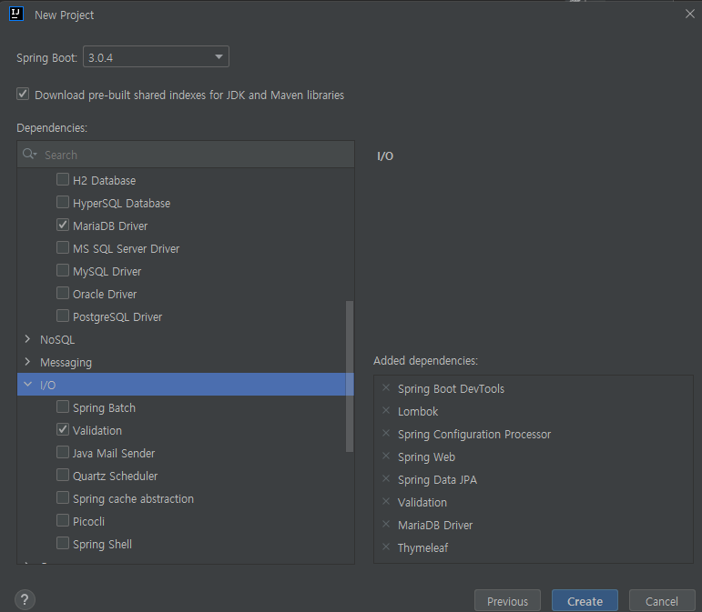

### SpringBoot + Gradle + Application.yml(WebMVC, JPA, MySQL, Logging, ThymeLeaf, Validation)

1. 프로젝트 생성
인텔리제이 File > New > Project 선택 후 Spring Initializr 를 선택하여 자바, Gradle 선택 후 다음\
\
위의 이미지처럼 패키지 선택

2. 설정 파일 추가
application.properties 파일을 삭제하고 application.yml 을 생성하여 spring mvc datasource, logging 을 설정


### 프로젝트 구조
```
├── HELP.md
├── README.md
├── build.gradle
├── gradlew
├── gradlew.bat
├── package.png
├── settings.gradle
├── gradle
│   └── wrapper
│    ├── gradle-wrapper.jar
│    └── gradle-wrapper.properties
├──src
├── main
│ ├── java
│ │ └── com
│ │     └── goosia
│ │         └── memo
│ │             ├── Application.java
│ │             ├── controller
│ │             │ ├── MainController.java
│ │             │ └── MemoController.java
│ │             ├── entity
│ │             │ └── Memo.java
│ │             ├── model
│ │             │ ├── MemoDTO.java
│ │             │ ├── MemoQueryVO.java
│ │             │ ├── MemoUpdateVO.java
│ │             │ └── MemoVO.java
│ │             ├── repository
│ │             │ └── MemoRepository.java
│ │             └── service
│ │                 └── MemoService.java
│ └── resources
│     ├── application.yml
│     ├── static
│     │ ├── css
│     │ │ └── main.css
│     │ └── images
│     │     └── cat.jpg
│     └── templates
│         ├── error
│         │ ├── 404.html
│         │ └── 500.html
│         ├── fragments
│         │ ├── footer.html
│         │ └── header.html
│         ├── layouts
│         │ └── default_layout.html
│         └── pages
│             ├── memos
│             │ ├── add.html
│             │ ├── detail.html
│             │ ├── index.html
│             │ └── update.html
│             └── template.html
└── test
    └── java
        └── com
            └── goosia
                └── memo
                    └── ApplicationTests.java


```

### mysql 계정 만들기
```
    create database db_memo;
    create user user_memo@localhost identified by '1234';
    grant all privileges on db_memo.* to user_memo@localhost;
```

### tables
```
drop table if exists memo;
create table db_memo.memo
(
    idx      int auto_increment comment '인덱스'
        primary key,
    contents text null comment '내용'
)
    comment '메모';
```